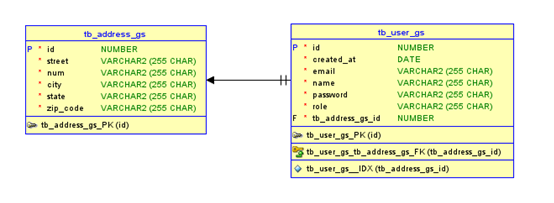
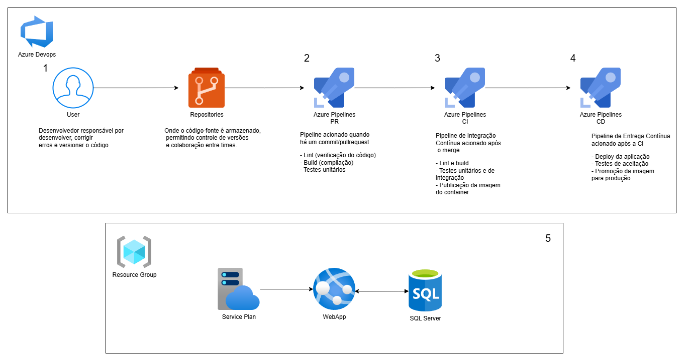

# Weather Emergency System

### Link p/ apresentação da solução: 

## Apresentação do projeto
A solução proposta consiste na integração entre a base de dados local do sistema e o serviço de Prevenção de Desastres do Serviço Geológico do Brasil (SGB), utilizando as informações de localização cadastradas pelos usuários para identificar riscos ambientais.

Quando um usuário cadastra sua conta com um endereço, os dados desse endereço são enviados para o SGB para consulta de possíveis riscos geológicos na região, como deslizamentos, inundações e outras ameaças naturais.

Na plataforma, há uma tela dedicada que exibe um mapa fornecido pelo serviço do SGB, posicionando o local exato do endereço cadastrado ou de qualquer outra localização que o usuário deseje consultar. Nesse mapa, eventuais riscos são destacados com cores específicas: amarelo para riscos moderados e vermelho para riscos mais graves, facilitando a visualização clara e imediata das áreas de alerta.

## Integrantes do Grupo

### Kauã Almeida Silveira
- **Responsável por:** API em Java Spring Boot, integração com o banco de dados.
### Rafael Vida
- **Responsável por:** DevOps no Azure e QA, garantindo o pipeline de integração contínua e a qualidade do software.
### Gustavo Maia
- **Responsável por:** Desenvolvimento do App em Kotlin para Android e site em C#.

## Instruções para Rodar a Aplicação

## Pré-requisitos para rodar a API Spring Boot:
- Java 21 ou superior instalado (para a API Spring Boot)
- Maven instalado (para a API Spring Boot)
- As configurações do banco de dados estão no arquivo `application-dev.properties` na pasta `src/main/resources`.

## Passo a Passo:

1. **Clone o repositório:**
   ```git clone https://github.com/gs-eventos-extremos/javaAdvancedGS```
2. **Acesse a pasta do projeto no intellij:**
3. **Defina o JDK no Intellij para Run & build do projeto**
4. **Rode a aplicação Spring Boot, localizada na pasta raiz**
   ```ChallengeJavaApplication.java```
## DER


## Diagrama Pipeline

